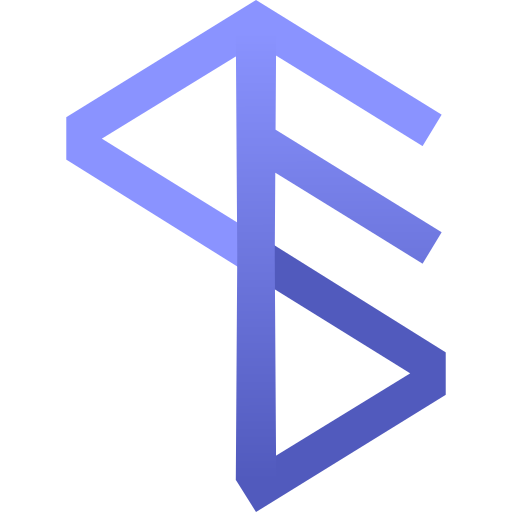

# Lhuna Stack

<p align="center">
    
</p>

<p align="center">
    <strong>Un boilerplate premium para desarrollo web rápido, responsivo y dinámico.</strong>
</p>

<p align="center">
    
    
    
    
</p>

---

## 🌟 Características Destacadas

Lhuna Stack es una plantilla base premium diseñada para optimizar los tiempos de desarrollo manteniendo los más altos estándares visuales y funcionales en interfaces modernas.

### 🎨 Sistema de Temas y Tokens Cromáticos
* **23 Paletas de Colores Curadas**: Selector dinámico de temas (Pizarra, Esmeralda, Índigo, Violeta, Negro y Blanco, etc.) que se inyectan como variables CSS nativas en la base del layout.
* **Control de Apariencia Dinámica**: Ajuste global y en tiempo real de la redondez de esquinas (Border Radius) y la intensidad de las sombras de los componentes.
* **Soporte Nativo Claro / Oscuro**: Transiciones suaves y contraste rigurosamente balanceado para máxima legibilidad tanto en ambientes de alta luz como en modos oscuros premium.

### 💎 Diseño Premium y Micro-animaciones
* **Componentes Exclusivos**: Cards con efectos de resplandor (`GlowCard`), tablas interactivas y contenedores con scroll de bordes desvanecidos integrados.
* **Animaciones Fluidas**: Efecto de logo latente con anillos concéntricos en el Login y Hero, y transiciones dinámicas de listas (`TransitionGroup`) en las tablas de datos para una experiencia interactiva superior.
* **Layouts Completos**: Vistas listas para producción de Autenticación, Dashboard de métricas, Panel de Usuarios y Configuración de Sistema.

---

## 🛠️ Stack Tecnológico

1. **Backend**: Laravel (Framework PHP elegante y robusto)
2. **Frontend**: Vue 3 (Composition API, Reactividad moderna)
3. **Pegamento (Bridge)**: Inertia.js (Single Page Application sin APIs complejas)
4. **Estilos**: Tailwind CSS (Utilidades optimizadas para diseño ágil)
5. **Base de Datos**: MySQL (Almacenamiento relacional rápido)

---

## 📋 Requisitos

* PHP 8.0+ con extensiones requeridas por Laravel
* MySQL 5.7+ o MariaDB
* Composer (Gestor de dependencias de PHP)
* Node.js 16.0+ y npm

---

## 🚀 Instalación y Despliegue Local

### 1. Clonar el repositorio
```bash
$ git clone git@github.com:pl402/lhuna-stack.git
$ cd lhuna-stack
```

### 2. Instalar dependencias
```bash
$ composer install
$ npm install
```

### 3. Configuración de Base de Datos (MySQL)
Accede a tu terminal de MySQL y crea la base de datos y el usuario asignado:
```sql
CREATE DATABASE lhuna CHARACTER SET utf8mb4 COLLATE utf8mb4_unicode_ci;
CREATE USER 'lhuna'@'localhost' IDENTIFIED BY 'C0n7r4s3ña!';
GRANT ALL PRIVILEGES ON lhuna.* TO 'lhuna'@'localhost';
FLUSH PRIVILEGES;
EXIT;
```

### 4. Variables de Entorno y Llave de Encriptación
Copia la configuración base y edita las credenciales en tu nuevo `.env`:
```bash
$ cp .env.example .env
```
Asegúrate de que las credenciales coincidan en el archivo `.env`:
```env
DB_CONNECTION=mysql
DB_HOST=127.0.0.1
DB_PORT=3306
DB_DATABASE=lhuna
DB_USERNAME=lhuna
DB_PASSWORD=C0n7r4s3ña!
```
Genera la llave de la aplicación y ejecuta las migraciones junto con el Seeder de prueba:
```bash
$ php artisan key:generate
$ php artisan migrate:refresh --seed
```

### 5. Ejecutar en Modo Desarrollo
Inicia el servidor local de desarrollo de PHP y compila los assets del frontend con el watcher activo para compilar cualquier cambio en tiempo real:
```bash
# Iniciar servidor Laravel (por defecto en http://127.0.0.1:8000)
$ php artisan serve

# En otra terminal, compilar assets continuamente
$ npm run dev
```

### 6. Credenciales de Acceso Base
Dirígete a `http://localhost:8000/` en tu navegador e ingresa con:
* **Usuario:** `correo@admin.com`
* **Contraseña:** `C0n7r4s3ña!`

---

## 📦 Despliegue en Producción

Compila y optimiza todos los scripts y hojas de estilo del frontend para producción:
```bash
$ npm run production
```

### Configuración del Trabajador de Colas (Queue Worker)
Para procesar tareas asíncronas en segundo plano, inicia el trabajador de colas:
```bash
$ nohup php artisan queue:work --sleep=3 --tries=3 &
```

#### Servicio Systemd en Servidores Linux (Producción)
Para asegurar que el queue worker se mantenga activo ante reinicios de servidor:
1. Crea el archivo de servicio en `/etc/systemd/system/lhuna-stack-queue.service`:
   ```bash
   $ sudo nano /etc/systemd/system/lhuna-stack-queue.service
   ```
2. Pega el siguiente contenido (asegúrate de adaptar las rutas de PHP y del proyecto a tu entorno real):
   ```ini
   [Unit]
   Description=Lhuna Stack Queue Worker
   After=network.target

   [Service]
   User=www-data
   Group=www-data
   WorkingDirectory=/var/www/lhuna-stack
   ExecStart=/usr/bin/php /var/www/lhuna-stack/artisan queue:work --sleep=3 --tries=3
   Restart=always

   [Install]
   WantedBy=multi-user.target
   ```
3. Guarda, cierra el archivo y activa el servicio:
   ```bash
   $ sudo systemctl daemon-reload
   $ sudo systemctl start lhuna-stack-queue
   $ sudo systemctl enable lhuna-stack-queue
   ```
